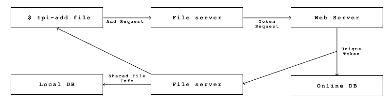
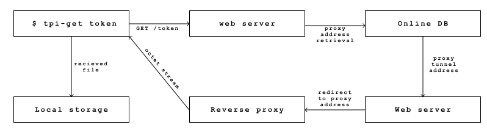

### Transfer π v0.0.2d

**This branch contians unix based distribution binaries for windows swtich to windows banch.**

> Setting up environment
```bash
$ git clone --single-branch --branch=master https://github.com/transfer-pi/transferpi
$ cd transferpi
$ ./setup.sh
```
> Running setup will produce following output

```
---------------------------------
|     Installing Transfer Pi    |
---------------------------------
* Removing Previous Installation 
* Appending Path
* Creating Services
   |_ Service Created For Fileserver
   |_ Service Created For Tunnel
* Transfer Pi Installed Successfully
```

After setting up transferpi, run following command to download config

```bash
$ tpi-manage login
```

This will take you to transferpi's login page, You can login or create account using your google account. After signing up it'll redirect you to config page where you save or download config file.

### Usage  

All of the cli tools communicates using network sockets, so to use cli tools you must run the fileserver, to start fileserver run following command

```bash
$ tpi-manage start fileserver
```

To share files over the internet you'll need to run the tunnel service you can also run the tunnel service using tpi-manage.

```bash
$ tpi-manage start tunnel
```

To add a file in sharing list run tpi-add with file name and it'll generate a unique token that can be used for sharing the file over the internet.

```bash
$ tpi-add hello.jpg
[+] file            : /home/user/images/hello.jpg
[+] filename        : hello.jpg
[+] local           : False
[+] md5             : 84442a0496d176cc208dd1af8b15193b
[+] time            : 2020-10-22 13:49:54
[+] token           : Bp9500
[+] type            : 1
[+] url             : https://transferpi.tk/token/Bp9500
```

To download files using generated tokens use tpi-get.

```bash 
$ tpi-get Bp9500
[*] Starting Donwnload : hello.jpg
[*] |▉▉▉▉▉▉▉▉▉▉▉▉▉▉▉▉▉▉▉▉▉▉▉▉▉▉▉▉▉▉▉▉▉▉▉▉▉▉▉▉▉▉▉▉▉▉▉▉▉▉| 
[*] Fetched 0 Mbs in 0.015292 Seconds
[*] Cheking MD5
[*] Check Successful.
[*] Downloaded hello.jpg Successfully.
```

### How does it work.

> Creating share token



> Downloading file



### Private file sharing

To share files privately use `-t=0` when adding the file. It'll add the file only to the local database. The file won't be downloadable using normal HTTP protocols or any kind of browsers.
```bash
> tpi-add file -t=0
```
To share a private file you might need to allow other host to access the private file. To do this you'll need to add the other host's public key to allowed hosts in your config file. To do this run following command.

```bash
> tpi-manage host add=public_key
```

Replace public_key with other host's public key.

To download this file other user might need to specify file host using `-H=host_name`.

```bash
> tpi-get UEIE -H=host_name
```

### CLI tools
* **tpi-add** : Adds files to sharing list

| Option   | Description  |
|----------|--------------|
| file     | filename or file path |
| -h       | help |
| -t       | to specify file sharing is public or private ( 1 for public, 0 for private ) |
| --force  | force to update the file sharing list if file already exist in list |
| --local  | use this option to share the file only locally |

`examples`

```bash
$ tpi-add hello.jpg
[+] file            : /home/user/path/to/hello.jpg
[+] filename        : hello.jpg
[+] local           : False
[+] md5             : 5cd5bc438994143c9bf84d716f4c80f
[+] time            : 2020-11-20 10:42:03
[+] token           : Qxl272
[+] type            : 1
[+] url             : https://transferpi.tk/Qxl272
```

* **tpi-get** : To download files directly in terminal / private downloads

| Option   | Description  |
|----------|--------------|
| token    | file token |
| -h       | help |
| -H       | to provide host of a file  |
| -o       | name of the output file |
| --local  | download file locally |

`examples`

```bash
$ tpi-get Qxl272
* Starting Donwnload : hello.jpg
* |##################################################| 
* Fetched 0.0908203125 Kbs in 0.053848 Seconds
* Cheking MD5
* Check Successful.
* Downloaded hello.jpg Successfully.
```

* **tpi-remove** : Remove files from sharing list

| Option   | Description  |
|----------|--------------|
| token    | file token  ( use ALL to remove all files from sharing list) |
| -h       | help |

`examples`

1. Removing specific file
```bash
$ tpi-remove Qxl272
File Removed From Sharing List
```
2. Removing all files
```bash
$ tpi-remove ALL
Table Emptied Sucessfully
```

* **tpi-manage** : Manipulate different services / configurations

| Option   | Description  |
|----------|--------------|
|start [service]   | starts provided service |
|restart [service] | restarts provided service |
|stop [service]    | stops provided service |
|set [key=value] [type=type]   | to modify config.json  |
|host [act=value]  | to add and remove hosts from allowed list |
|config [options]  | prints current config  |
|login [options]  | opens a browser window for login  |

`examples`

1. starting / restarting / stopping services

```bash
$ tpi-manage start fileserver
$ tpi-manage restart fileserver
$ tpi-manage stop fileserver
```

2. Changing config

```bash
$ tpi-manage set server_config:remote:port=8080 type=int
```

3. Adding host to allowed list
```bash
$ tpi-manage host add=public_key
```


### The config.json

```js
{
    "subdomain" : "vptl185", // Username used for reverse proxy URL -> Do not change this
    "account_keys" : {             // Do not change these
        "private" : "private key", // Private API key  
        "public" : "private key"   // Public API key
    },
    "allowed_hosts" : [
            "a","list","of","allowed","hosts",
            "for","private","file","access"
         ], // These can be changed through tpi-manage
    "server_config" : {               // Config for various servers -> change these as your needs
        "remote" : {                  // Proxy server config
            "host" : "tpialpha.tk",   
            "port" : 80,
        },
        "local" : {                  // Fileserver config -> change these as your needs
            "host" : 0.0.0.0,
            "port" : 2121,
            "n_pools" : 5,
            "chunk_size" : 512      
        },
        "web" : {                   // Web / Auth / DB server 
            "host" : "https://transferpi.tk"
        },
    }
}
```